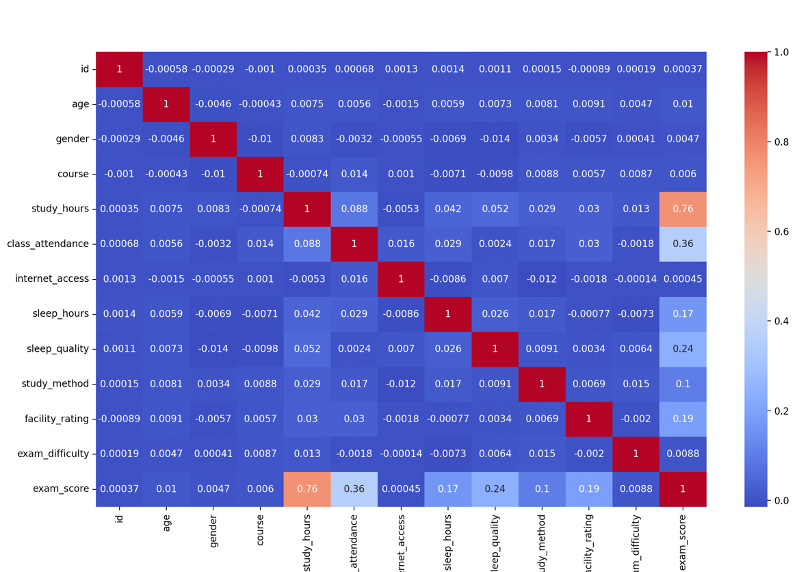
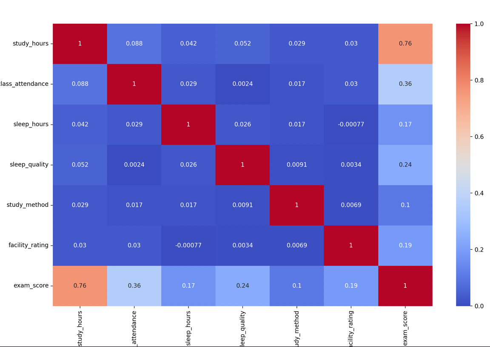
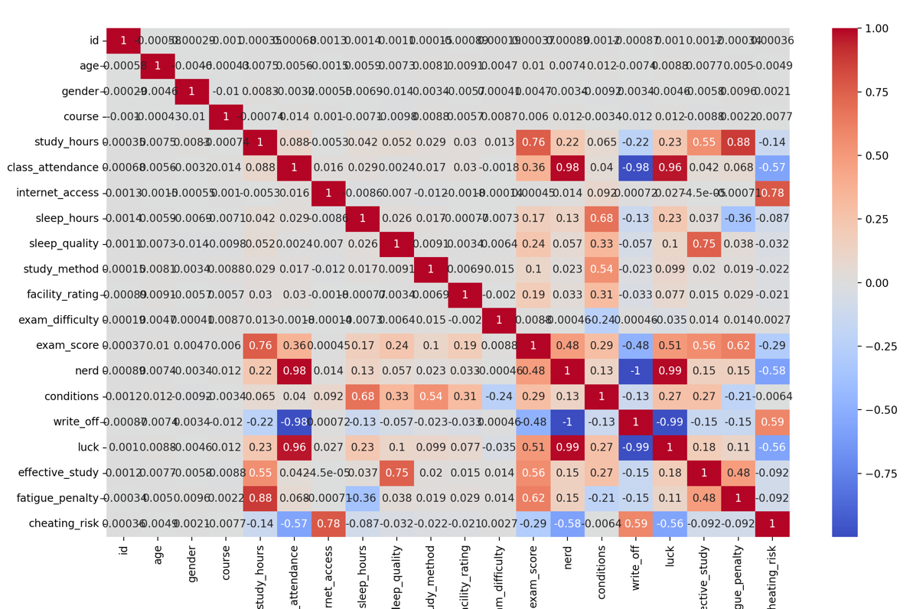
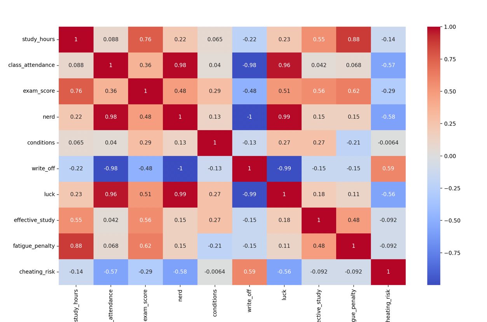
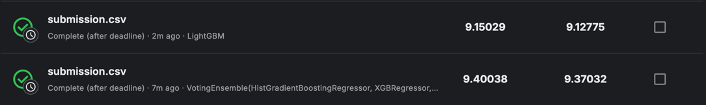

# Predicting Student Test Scores
* Link: https://www.kaggle.com/competitions/playground-series-s6e1
* To load data: run data_loader.py

## Dataset Description
The dataset for this competition (both train and test) was generated from a deep learning model trained on the Exam score prediction dataset. Feature distributions are close to, but not exactly the same, as the original. Feel free to use the original dataset as part of this competition, both to explore differences as well as to see whether incorporating the original in training improves model performance.

## Files
* train.csv - the training set
* test.csv - the test set
* sample_submission.csv - a sample submission file in the correct format

## EDA and data prepare
* To explore EDA check: EDA_and_data_prepare.py
* Matrix of correlation:

* Matrix of correlation(most important and normalized features):

* To get cleaned and scaled data for training, run EDA_and_data_prepare.py and find train_data_cleaned_scaled.csv.

* Influence of features on the target

## Models:
* **LinearRegression** - R² on the test sample: 0.7515, MAE on the test sample: 7.52
* **RandomForestRegressor** - R² on the test sample: 0.7728, MAE on the test sample: 7.20
* *RidgeRegression** - R² on the test sample: 0.7515, MAE on the test sample: 7.52
* **LassoRegression** - R² on the test sample: 0.7515, MAE on the test sample: 7.52
* **ElasticNet** - R² on the test sample: 0.7515, MAE on the test sample: 7.52
* **PolynomialRegression** - R² on the test sample: 0.7793, MAE on the test sample: 7.08
* **GradientBoostingRegressor** - R² on the test sample: 0.7804, MAE on the test sample: 7.05
* **XGBRegressor** - R² on the test sample: 0.7848, MAE on the test sample: 6.97
* **LGBMRegressor** - R² on the test sample: 0.7849, MAE on the test sample: 6.97
* **HistGradientBoostingRegressor** - R² on the test sample: 0.7826, MAE on the test sample: 7.02
* **DecisionTreeRegressor** - R² on the test sample: 0.7793, MAE on the test sample: 7.06
* **CatBoost** - R² on the test sample: 0.7812, MAE on the test sample: 7.04
* **VotingEnsemble(HistGradientBoostingRegressor, XGBRegressor, LGBMRegressor)** - R² on the test sample: 0.7853, MAE on
the test sample: 6.97

## Tuning data and model
* Tuning data check data_tuning.py and FeatureSelect.py.

* After added new features:

* After elimination:

* New features didn't improve final results - R² on the test sample: 0.7455, MAE on the test sample: 7.62

## Submission to kaggle:

## Deploy in Docker
To deploy submission.py we need to create new directory *docker_build*, it contain:
* .dockerignore
* Dockerfile
* LGBMRegressor.pkl
* requirements.txt
* scaler.pkl
* submission.py
* test.csv

After install docker in terminal execute these commands:

*cd (path to docker_build)*

*docker build -t student-scores .*

*docker run student-scores*

After you will get your file *submission.csv* 

## Final:
Best results was showed by LightGBM(In docker - container), VotingEnsemble(HistGradientBoostingRegressor, XGBRegressor, LGBMRegressor) turned out to be worse. Feature Engineering didn't improve quality of models prediction. 
